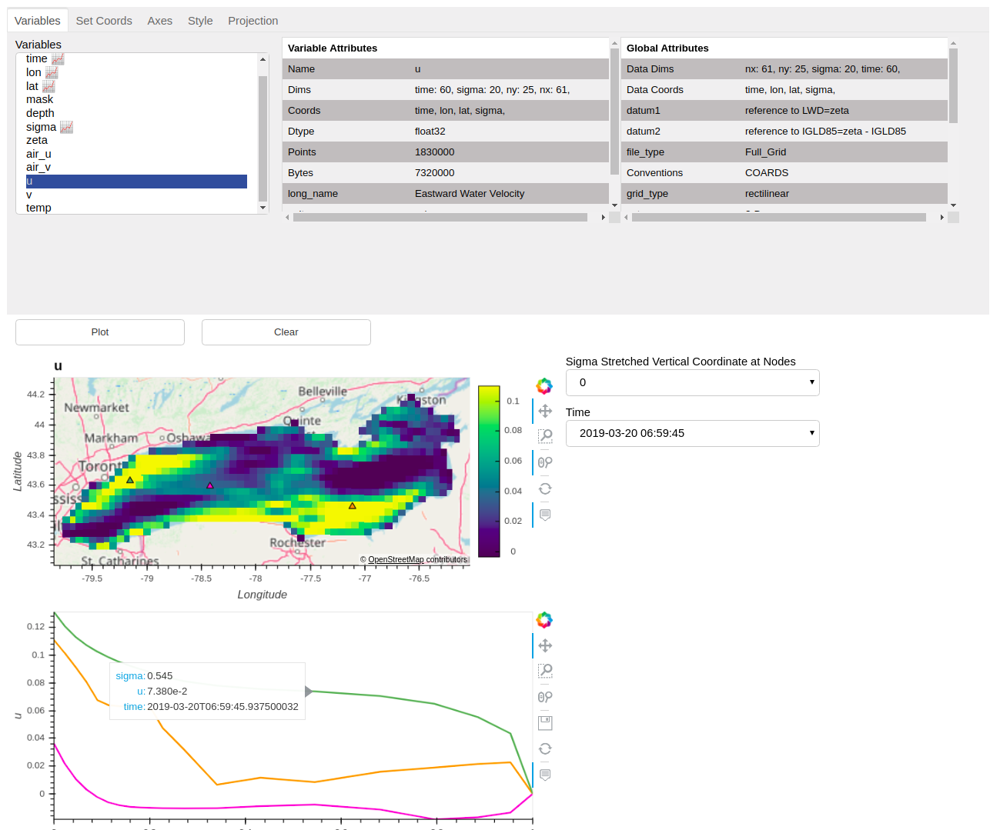

XrViz
=====

*An interactive visualisation interface for Xarrays*

XrViz is an interactive graphical user interface(GUI) for visually browsing Xarrays.
You can view data arrays along various dimensions, examine data values, change
color maps, extract series, display geographic data on maps and much more.
It is built on `Xarray <http://xarray.pydata.org>`_,
`HvPlot <https://hvplot.pyviz.org>`_ and `Panel <https://panel.pyviz.org/>`_.
It can be used with `Intake <http://intake.readthedocs.io/>`_
to smoothen the process of investigating and loading datasets.

It offers the following functionality:

1. Quick visualization of xarray data.
2. No need to write any custom code thus saves immense time of users.
3. Different panes to customize the output graph by interaction with
   the widgets.
4. Easy exploration of data present on cloud using Xarray's ability
   to read remote data.
5. Easy exploration of geographical, meteorological, and oceanographic
   datasets using `Geoviews <http://geoviews.org/>`_.
6. Automatic guessing of correct coordinates for ``x`` and ``y`` axis using
   `Metpy <https://unidata.github.io/MetPy/latest/api/generated/metpy.calc.html>`_
   for data following the CF conventions.
7. Aggregations along remaining dimensions in case of multi-dimensional
   variables.
8. Extract series for third dimension in a separate graph by clicking on
   the main 2D graphical output.

.. toctree::
   :maxdepth: 2
   :caption: Documentation Contents

   quickstart.rst
   interface
   set_initial_parameters
   api

Indices and tables
==================

* :ref:`genindex`
* :ref:`modindex`
* :ref:`search`
