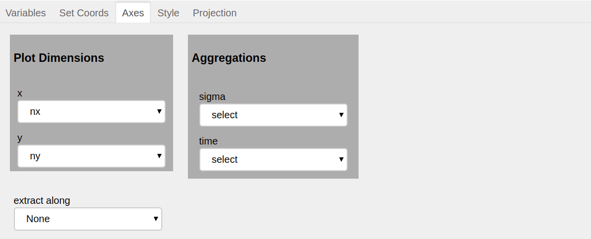
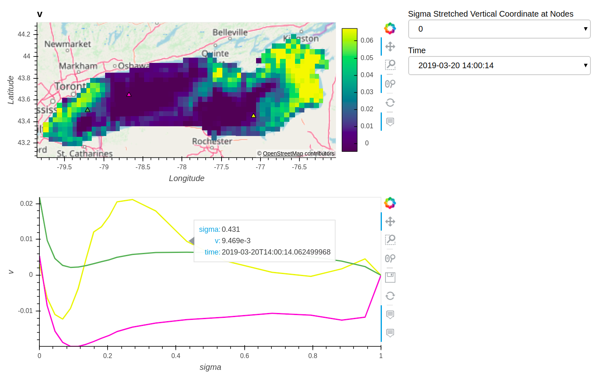

Graphical User Interface
########################

The following five panes are part of XrViz's interface:

Variables
=========

.. image:: _static/images/variables.png

This pane displays `Xarray variables`_ in the list, with
`coordinate variables`_ indicated by the graph icon(📈). Attributes
for the selected variable and global attributes for the dataset are
displayed on the right.

More information about this pane in :py:class:`Display<xrviz.display.Display>`
and :py:class:`Describe<xrviz.describe.Describe>`.

.. _`Xarray Variables`: https://github.com/hdsingh/xrviz/blob/a0fd2fe6e917ff8b8c5be21828b6235cc9248f1a/docs/source/variables.rst#L6
.. _`coordinate variables`: http://xarray.pydata.org/en/stable/data-structures.html#coordinates

Set_Coords
===========

.. image:: _static/images/set_coords.png

This pane allows the list of data coordinates to be modified by adding
or removing variables using the ``<<`` and ``>>`` widgets.

More information about this pane in
:py:class:`CoordSetter<xrviz.coord_setter.CoordSetter>`.

.. _`xarray coordinates`: http://xarray.pydata.org/en/stable/data-structures.html#coordinates

Axes
====

This pane controls which array dimensions should be mapped,
how additional dimensions should be handled, and which dimension
series plots should be extracted along. The options available
in this pane, update upon selection of a new variable.

It has three different sub-sections.

1. Plot Dimensions
------------------

.. raw:: html

   

It has following two selectors:

- ``x``: To select which of the available dimensions/coordinates
  in the data is assigned to the plot's x (horizontal) axis.
- ``y``: To select which of the available dimensions/coordinates
  in the data is assigned to the plot's y (vertical) axis.

``x`` selector has both variable dims and coordinates available
as options. However, the options available in the ``y`` selector depend
on the selection for ``x``. If the selection in ``x`` is a dimension,
``y`` will have remaining dimensions as options. Similarly, for the
case when a coordinate has been selected in ``x``, only remaining
coordinates will be available in ``y``.

For the data following the CF conventions, the default value of
``x`` and ``y`` is filled according to guess made using `Metpy`_ .
In other cases it is filled according to alphabetical order of the
available options.

2. Aggregations
---------------

.. raw:: html

   

The remaining dimensions (which have not been selected or
present in coordinates selected for ``x`` and ``y``) can be aggregated along.

3. Extract Along
----------------

.. raw:: html

   

This selector provides the option to select the dimension along which to
create a series graph. The default option is ``None``, with which this
feature is disabled. After selecting a
dimension and clicking ``PLOT``, the user can click on the main 2D graphical
output, and have a graph of the third dimension at that point appear
below it. Each click will produce a marker on the main plot and a line in the
series graph, which will have same colour as that of the marker.
Several lines can be over-plotted. Each line in the series graph displays
the value of  dimensions/coordinates for which it has been extracted upon
hovering over it. Also the series would be extracted in accordance to the
values for which main graph has been created. Upon selecting a new dimension
to extract along, the previous markers and series graph will clear.

More information about this pane in in
:py:class:`Axes<xrviz.fields.Fields>`.

.. note::
    1. ``Clear`` button is applicable only for series extraction. It clears the
       markers and series graph when clicked.
    2. Series extraction is independent of aggregation i.e. it is
       possible to aggregate and extract along a same dimension.

.. _Metpy: https://unidata.github.io/MetPy/latest/api/generated/metpy.calc.html
.. _player: https://panel.pyviz.org/reference/widgets/DiscretePlayer.html

Style
=====

.. image:: _static/images/style.png

This pane provides the options to customize the style of the output graph.

More information about this pane in :py:class:`Style<xrviz.style.Style>`.

Projection
==========

.. image:: _static/images/projection.png

This pane provides the option to project the data on a map or
`cartopy projection`_ in case it is geographical. The geographic
plots are created using `Geoviews`_, hence giving the option to
visualize geographical, meteorological, and oceanographic datasets.

More information about this pane in
:py:class:`Projection<xrviz.projection.Projection>`.

.. _`cartopy projection`: https://scitools.org.uk/cartopy/docs/v0.15/crs/projections.html
.. _`Geoviews`: http://geoviews.org/
