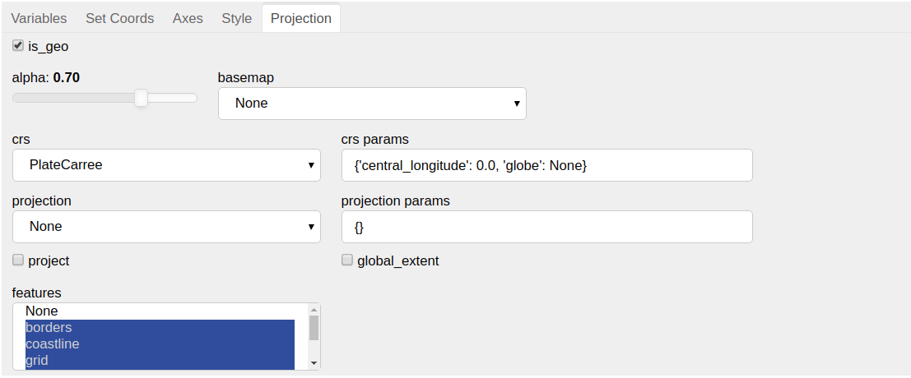

Projection
==========

This tab provides the option to project the data on a map or
`cartopy projection`_ in case it is geographical. The geographic
plots are created using `Geoviews`_, hence giving the option to
visualize geographical, meteorological, and oceanographic datasets.

It provides the following options:

1. ``is_geo`` (default `False`):
    Allows the user to decide whether or not to geographically
    project the data. If `True`, the other options in this tab are enabled.
2. ``alpha`` (default 0.7):
    To adjust the opacity of the quadmesh on the map or projection.
3. ``basemap`` (default `None`):
    To select basemap for the data from the available `tile_sources`_.
4. ``crs`` (default `PlateCarree`):
    Here `crs` refers to `cartopy coordinate reference system`_, which
    declares the coordinate system of the data. It specifies the input
    projection, i.e. it declares how to interpret the incoming data values.
    It allows the user to select the `crs` in which data is present.
5. ``crs params``:
    The default input parameters for each `crs` are auto filled upon
    selection. It allows the user to customize certain aspects of the
    projections by providing extra parameters such as ``central_longitude``
    and ``central_latitude``. For more details refer to
    `cartopy coordinate reference system`_.
6. ``projection`` (default `None`):
    To select what coordinate system to display the data in.
    We can also state it as output projection, i.e. how you want to map the
    data points onto the screen for display.
7. ``projection params``:
    The default input parameters for each `projection` are auto filled upon
    selection. It allows the user to customize certain aspects of the
    projections by providing extra parameters such as ``central_longitude``
    and ``central_latitude``.
8. ``project`` (default=`False`):
    Whether to project the data before plotting (adds initial overhead
    but avoids projecting data when plot is dynamically updated).
9. ``global_extent`` (default=`False`):
    Whether to expand the plot extent to span the whole globe.
10. ``features`` (default=all except `None`):
    To select a set of basic geographic features to overlay behind the data
    in the plot.

.. note::
        1. The widgets in this tab are enabled only if both ``x`` and ``y`` are
           data coordinates.
        2. `basemap` and `projection` are mutually exclusive options i.e it is not
           possible to have them both enabled simultaneously.

.. _`cartopy projection`: https://scitools.org.uk/cartopy/docs/v0.15/crs/projections.html
.. _`Geoviews`: http://geoviews.org/
.. _`tile_sources`: http://geoviews.org/gallery/bokeh/tile_sources.html
.. _`cartopy coordinate reference system`: https://scitools.org.uk/cartopy/docs/v0.15/crs/index.html#coordinate-reference-systems-in-cartopy
