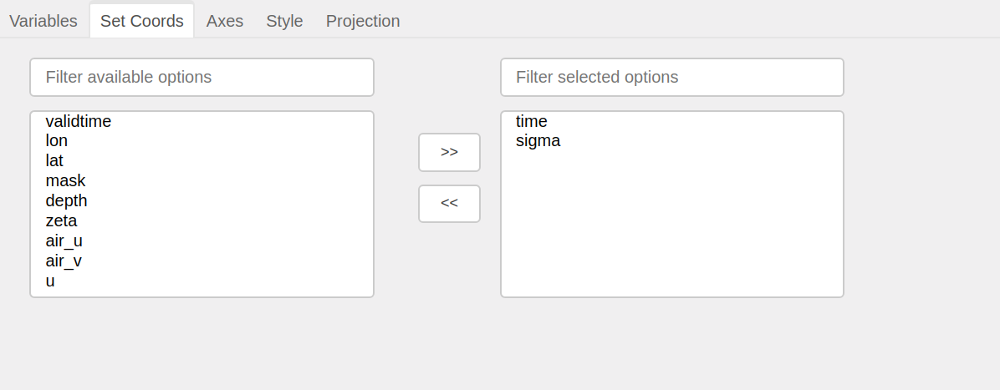

Set Coords
===========

This panel provides the option to set and reset the coordinates.
It uses a `Cross Selector <https://panel.pyviz.org/reference/widgets/CrossSelector.html>`_
to display a list of simple and coordinate variables.
Simple variables (which are not data coordinates) are available on
left side and default coordinates are available on right side.
To set variables as coordinates, make selection on left side and click
``>>``. Similarly making selection on right side and clicking ``<<``
will reset the coordinates.This will update the underlying dataset/dataArray.
Other panels would also update accordingly.

This panel makes use of `set_coords`_ and `reset_coords`_ method.

.. note::  You cannot reset the default indexed coordinates.

.. _set_coords: http://xarray.pydata.org/en/stable/generated/xarray.Dataset.set_coords.html
.. _reset_coords: http://xarray.pydata.org/en/stable/generated/xarray.Dataset.reset_coords.html
