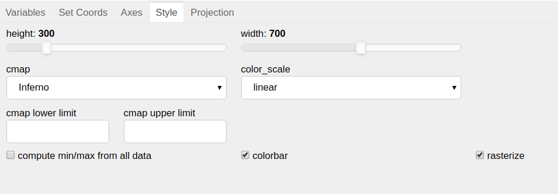

Style
=====

This tabs provides the options to customize the style of the output graph.

It provides following options:

1. ``height`` (default `300`):
    To modify the height of main and series graph.
2. ``width`` (default `700`):
    To modify the width of the main and series graph.
3. ``cmap`` (default `Inferno`):
    To select a colormap for the main graph.
4. ``color_scale`` (default `linear`):
    To scale the values to be plotted.
    The scaling options available are ``linear``, ``exp``, ``log``,
    ``reciprocal``, ``square`` and ``sqrt``. Here ``linear`` implies
    no scaling.
5. ``cmap limits``:
    To change the colormap limits. User can fill these limits before
    plotting a variable. In case not filled by user, automatic filling
    of limits happen.

    - ``lower limit``: auto-filled value equals ``quantile(0.1)`` of values
       to be plotted.

    - ``upper limit``: auto-filled value equals ``quantile(0.9)`` of values
       to be plotted.

    Note that these values are filled with respect to color scaled values.
    Also these limits clear upon change in variable or color scaling.

6. ``compute min/max from all data`` (default `False`):
    - `True`: all values present in a data variable are used to compute
       upper and lower colormap limits.
    - `False`: only values necessary to create first step/instance
       of graph are used.

    It is better to have its value `False` for larger datasets, to save
    computation time.
7. ``colorbar`` (default `True`):
    Provides option to display/hide colorbar.
8. ``rasterize`` (default `True`):
    Provides option to use `data shading <http://datashader.org/>`_ .
    It is better to have its value `True`, to get highly optimized rendering.
