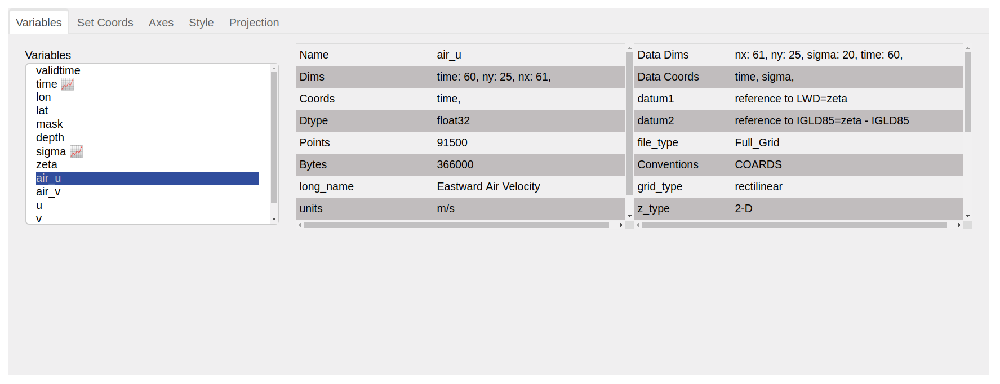
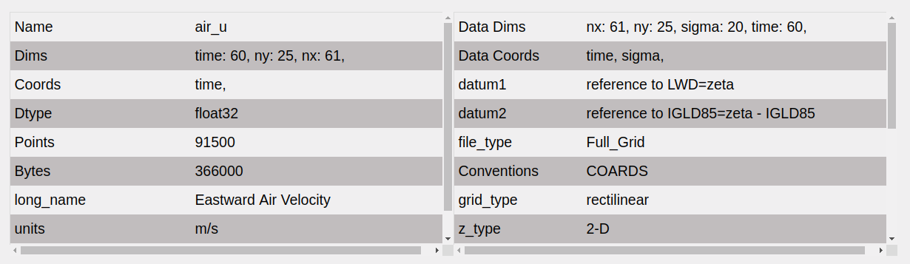

Variables
=========

This panel shows the variables available along with their properties.
It also allows the user to select a variable for further analysis in
other panels.It has two parts.

1. Displayer
------------

.. raw:: html

   

This multiselect widget acts both as a displayer and selector. It
displays all the variables present in the Dataset or DataArray.
The variables which are coordinates are annotated with the  ‘📈’
symbol. Upon selection of a variable, its properties are updated
in the adjoining description section.

2. Describer
------------

The describer or description section consists of two striped tables.
The first tables shows properties specific to the selected variable.
It values update according to the variable selected in displayer.
For any variable the following properties are shown:

1. ``Name``
2. ``Dims``
3. ``Coords``
4. ``Dtype``
5. ``Points``
6. ``Bytes``
7. ``Variable Attributes``

The second table shows attributes related with the Dataset or DataArray.
Unlike first table, it does not updates. For a Dataset/DataArray following
properties are shown:

1. ``Data Dims``
2. ``Data Coords``
3. ``Attributes``
