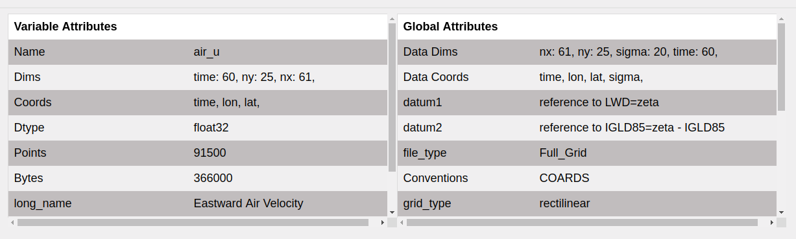

Variables
=========

.. image:: _static/images/variables.png

Here "Variable" refers to `xarray.Variable <http://xarray.pydata.org/en/stable/generated/xarray.Variable.html>`_
i.e a netcdf-like variable consisting of dimensions, data and attributes which
describe a single Array.

This tab displays all the data variables from which user selects a variable
to plot. Upon selection of a variable, its information is updated in the
adjoining description section. It has two parts:

1. Variables Selector
---------------------

.. raw:: html

   

This multiselect widget displays all the variables present in the data from
which user selects a variable to plot. The variables which are coordinates
are annotated with the  ‘📈’ symbol. You can change which variables are
considered as coordinates in the :doc:`set_coords` tab.

2. Description section
----------------------

The description section consists of two striped tables showing
``Variable Attributes`` and ``Global Attributes``.

The ``Variable Attributes`` table shows properties specific to the
selected variable. Its values update according to the variable selected.
For any variable the following properties are shown:

1. ``Name``
2. ``Dims``
3. ``Coords``
4. ``Dtype``
5. ``Points``
6. ``Bytes``
7. ``Attributes``

The ``Global Attributes`` table shows properties related with the data.
Unlike first table, it remains constant. For a data following
properties are shown:

1. ``Data Dims``
2. ``Data Coords``
3. ``Attributes``
