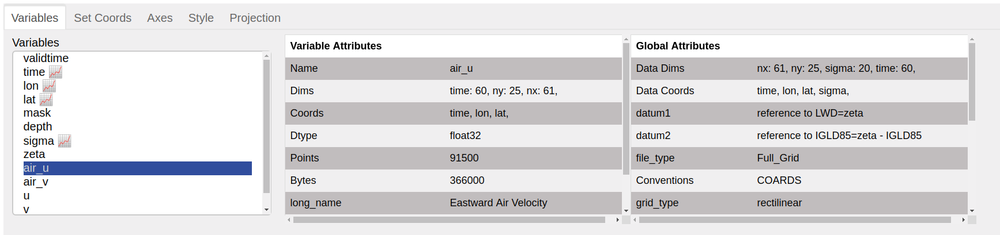

Variables
=========

This pane displays `Xarray variables`_ in the list, with
`coordinate variables`_ indicated by the graph icon(📈). Attributes
for the selected variable and global attributes for the dataset are
displayed on the right.

.. _`Xarray Variables`: https://github.com/hdsingh/xrviz/blob/a0fd2fe6e917ff8b8c5be21828b6235cc9248f1a/docs/source/variables.rst#L6
.. _`coordinate variables`: http://xarray.pydata.org/en/stable/data-structures.html#coordinates
